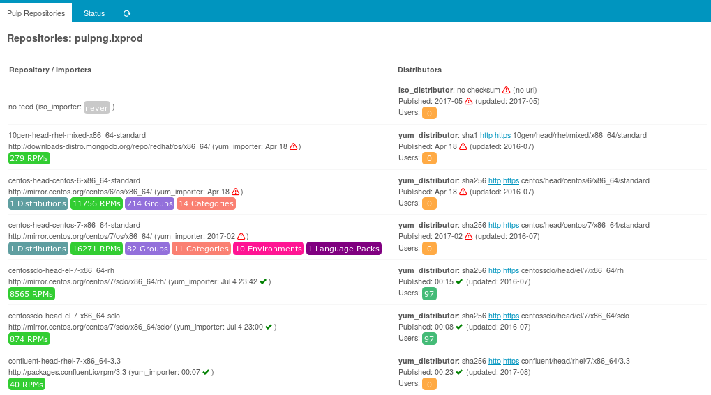
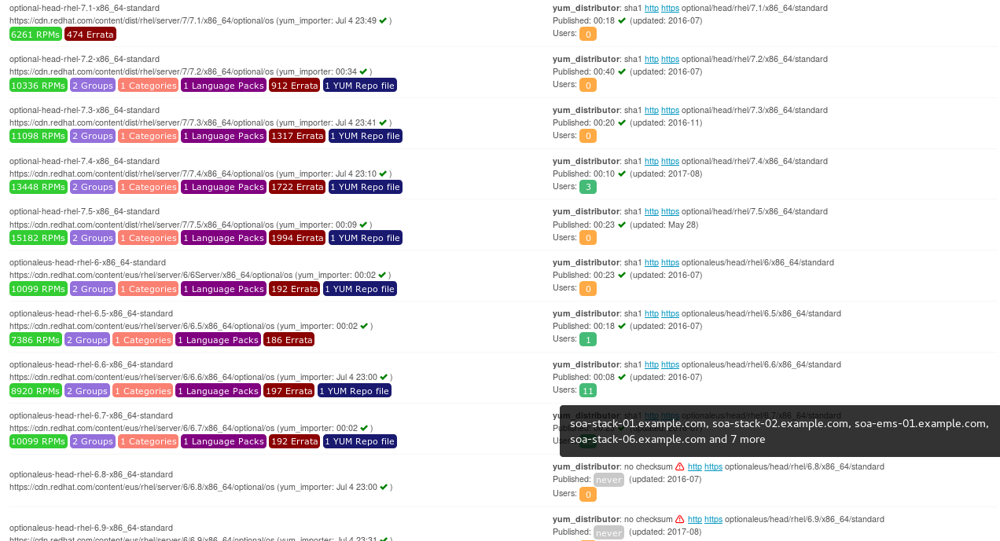
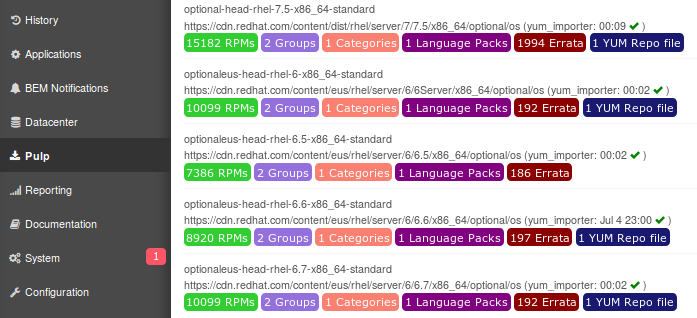

Pulp module for Icinga Web 2
============================

This is a quick & dirty module accomplishing a very few Pulp-related tasks:

* show current overall Pulp status
* show task status

Screenshots
-----------

### Main overview

This module shows all your repositories, content statistics, import and publish
times. It links your published repository URLs and shows warnings if any:

### Repository users

When such information has been provided (currently only via PuppetDB) it shows
how many (and which) servers are using a specific repository:

### Menu entry

This overview is reachable via the related menu entry:

Future development
------------------

So far, there are no such plans.

> In case someone is willing to sponsor related development, this could easily
> be transformed in a full-blown web frontend for Pulp.
